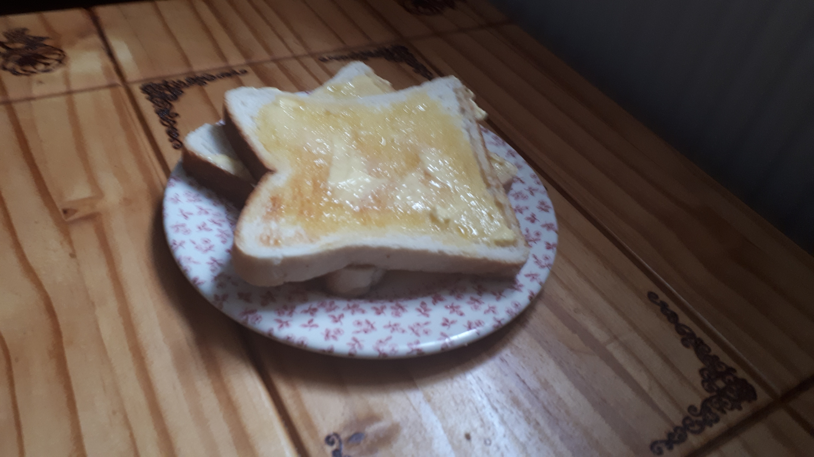

# Toaster used:
	https://uk.russellhobbs.com/product/futura-2-slice-18780

# One Slice Contains:
	Fat(g)		- 0.64
	Carbs(g)	- 8.53
	Protein(g)	- 4.6
	Calories	- 76

# Toasted for:
	46 seconds
 
# Heated at: 
	140°C 
# On Dial Setting:
	2

# Eaten with:
- Homemade butter from locally sourced milk

# Optional things
- Cracking an egg from your pet chicken and having some scrambled egg toasties

# Finished Result

Enjoy your toast!
